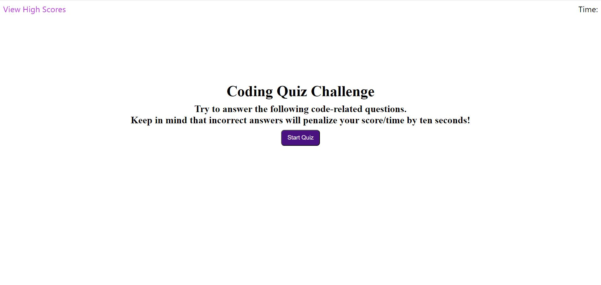

# JavaScript-Coding-Quiz

This webpage hosts a short quiz about fundamental JavaScript features. Once the user starts the quiz they are given 120 seconds to answer all the questions. At the end of the quiz, their time left will be their score, and they may save their score to local storage. All high scores may be seen as well as cleared. The quiz may be taken as many times as the user wishes. 
["Link to Website"](https://kylemoely.github.io/JavaScript-Coding-Quiz/)

